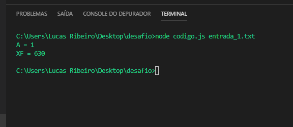

<h1>Desafio SuperClient Solutions</h1>

<h4>Instruções para a execução do programa.</h4>

O desafio foi realizado com a linguagem JavaScript (node), para executar o programa basta seguir alguns passos como descritos abaixo:

<ul>
  <li>Abrir o terminal do seu sistema operacional (cmd no Windows);</li>

  <li>Acessar o diretório que contém os arquivos do desafio, (neste caso o nome do diretório que está sendo enviado é “desafio”);</li>

  <li>Logo após acessar o diretório que contém os arquivos do desafio, basta digitar o seguinte comando para execução do programa: node <nome do arquivo.js> <nome da entrada.txt> </li>
</ul>
<h4>OBS: Neste caso o nome do arquivo é “código.js”, e a entrada pode ser qualquer um dos arquivos de texto, que acompanham no diretório.</h4>

A figura logo abaixo ilustra o comando sendo executado e o retorno do script:

